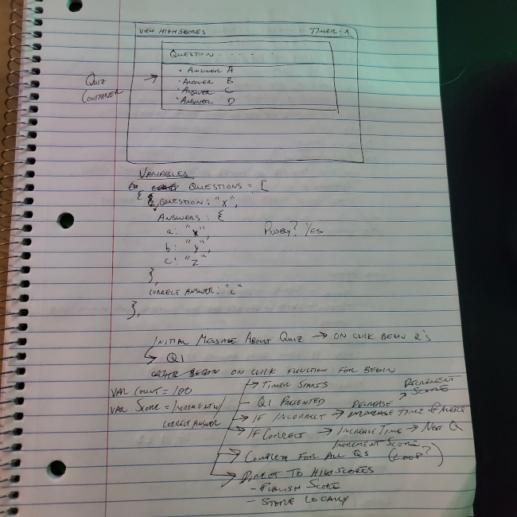
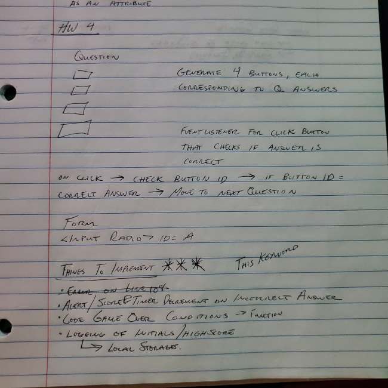

# courseWork_04_codeQuiz

# Description
The purpose of this assignment was to create a timed quiz using multiple choice questions. The quiz that I created uses MLB rules and records as a theme and begins with a timer of 40 seconds. Each correct answer increases the timer by 10 seconds and the user score by 1000 points. While each incorrect answer results in the timer and score decreasing by the same amounts. 

When a user answers a question correctly, the next question is rendered to the page until all questions have been successfully answered or the timer runs out. If the user answers all questions correctly they are alerted and brought to the highscores page to log their name and score. 

# Pseudo Code 

